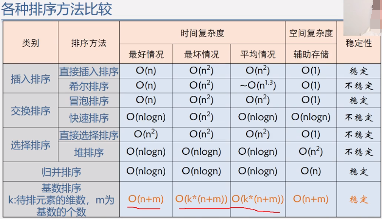
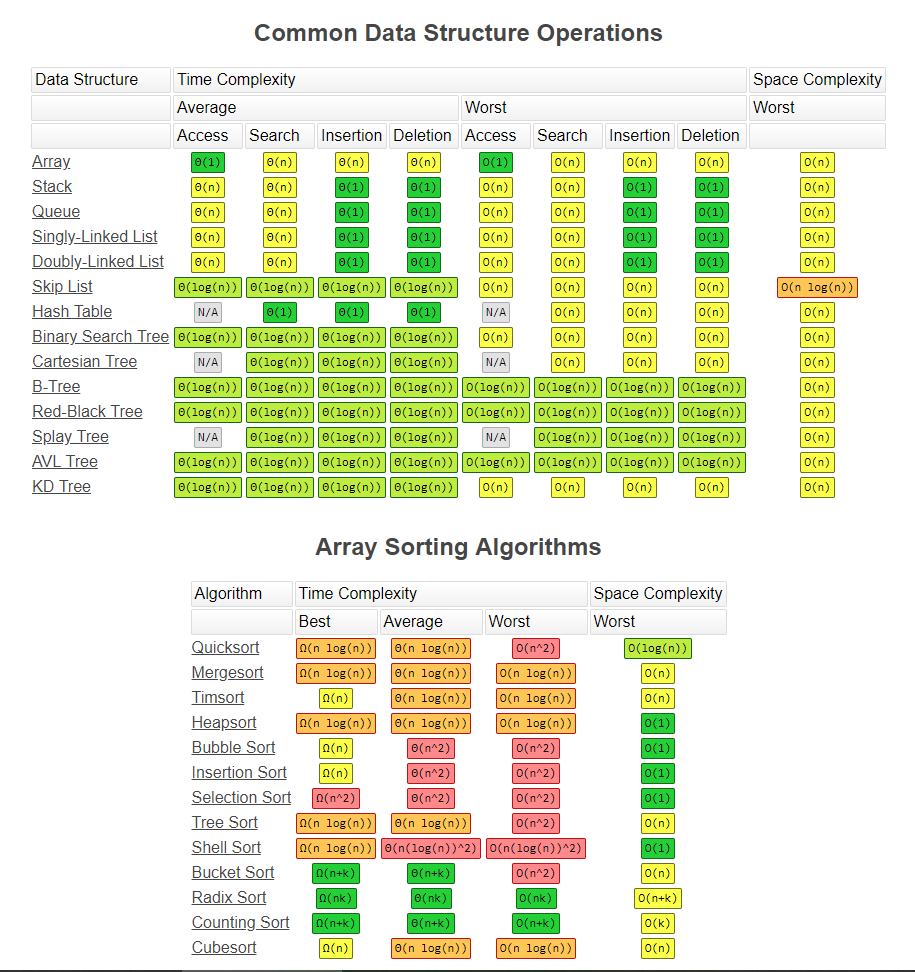

# 学习算法,终生学习.
> 算法本质是使程序片段执行得到一种最优最快的方法,
从而实现计算量最少最优,CPU占用最低,响应最快的结果.

## 实战算法
> 提供golang,php,c语言及多种解法实现.详细每一个步骤 
1. [https://github.com/yezihack/leetcode](https://github.com/yezihack/leetcode)

## 图解算法
[https://visualgo.net/](https://visualgo.net/)

## 数据结构图谱

## 算法好坏基本判断
1. 时间复杂度,使用大O表示法.如O(1), O(n), O(LogN)
1. 空间复杂度.

## 如何分析算法题
1. 找到数据之间的规律,得出通用公式
1. 将大问题不断缩小范围,得到一个最小范围解
1. 借用空间换时间.

## 蓝蝙蝠算法系列
1. [数组转换成最小值](24.蓝蝙蝠面试算法/01.数组转换成最小值.go)

## 排序
1. [冒泡排序](16.排序算法/03.冒泡排序.go)
1. [插入排序](16.排序算法/01.插入排序.go)
1. [选择排序](16.排序算法/05.简单选择排序.go)
1. [希尔排序](16.排序算法/02.希尔排序.go)
1. [归并排序](16.排序算法/08.归并排序.go)
1. [快速排序](16.排序算法/04.快速排序.go)
### 排序的总结

## 列表
1. [斐波那契数列](fibonacci/main.go) chan实现
1. [二分法实现](dichotomy/demo.go) 多种写法
1. [双链表实现](DoubleLinedList/README.md) 并发安全
1. [FIFO先进先出算法实现](Cache/README.md) 双链表实现
1. [LRU最少最近算法实现](Cache/README.md) 双链表实现
1. [LFU最不常用算法实现](Cache/README.md) 双链表实现

## 树
1. [基本定义与概念](tree/README.md)
1. [二叉树基本操作](tree/binary_tree.go)
1. [哈夫曼树](tree/huffman_tree.go)

## 贪心思想
1. [非负整数a,删除k个元素,求最大值](21.贪心思想/01.求最大值.go)

## 动态规划
1 [最长公共子串](23.动态规划/02.最长公共子串.go)
1 [最长公共子序列](23.动态规划/03.公共子序列.go)

## 递归题
1. [顺时针打印矩阵](01.递归算法/07.顺时针打印矩阵.go)

## 各种算法已代码实现
1. 极客时间算法: https://github.com/wangzheng0822/algo

## Common Data Structure Operations
1. http://www.bigocheatsheet.com/

### 时间复杂度

## 学习笔记
1. [王卓老师的<<数据结构与算法>>](https://www.bilibili.com/read/cv3285768)
1. [脑图笔记](https://mubu.com/doc/75lsJgfMh6C) 
1. [代码实现](https://github.com/yezihack/algo)
3. 仅供同学们参考